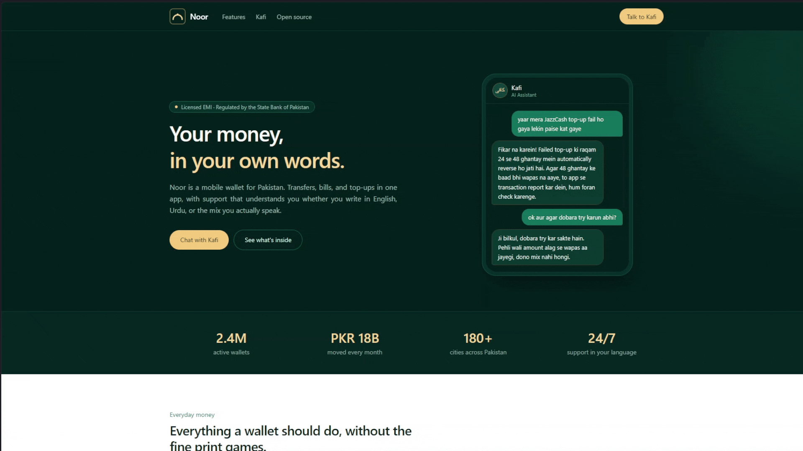

# Kafi — کافی

A bilingual customer support assistant for **Noor**, a fictional Pakistani mobile wallet. Kafi answers questions the way Pakistanis actually write them — English, Roman Urdu, Urdu script, or the code-switched mix in between ("yaar mera top-up fail hogaya, refund kab milega?") — and replies in the same language, grounded in a real FAQ knowledge base instead of guesswork.

The name comes from the Sufi poetic form (Bulleh Shah, Shah Hussain) — poetry written in the mixed vernacular of ordinary speech to make complex ideas accessible to everyone. Same idea, applied to customer support.

**Live demo:** [noor on Vercel](https://kafi.vercel.app) · Frontend: React + Tailwind on Vercel · Backend: FastAPI on Render



## The problem

Support bots for Pakistani products force a choice that users never made: write in proper English or proper Urdu. Real users do neither — they type Roman Urdu with unstandardized spelling ("kahan" / "kaha" / "khan"), mix English freely mid-sentence, and make typos on top. Naive embedding search on that text against an English FAQ collapses. Kafi is built for that user, and treats code-switching as the *primary* case, not an edge case.

## How it works

A two-step pipeline, because direct multilingual embedding retrieval proved too fragile:

1. **Normalize + classify** (one LLM call): the raw message is rewritten as a clean English search query, and classified by language (`english` / `roman_urdu` / `code_switched` / `urdu_script`) and type (`question` / `smalltalk`). Two deterministic guards then override the LLM where it can be wrong: any Arabic-script character forces `urdu_script`, and a Latin message containing zero Roman-Urdu marker words is English — typos can make English look strange, but they can't inject Urdu vocabulary.
2. **Retrieve**: the normalized English query is searched against the FAQ knowledge base in ChromaDB using local embeddings. Small talk ("ok, will try") skips retrieval entirely — similarity search always returns *something*, and stray FAQ context tempts the model into volunteering topics the user never asked about.
3. **Generate**: the reply is grounded strictly in the retrieved FAQs and mirrors the user's language via a hard directive — a fully-English user gets fully-English answers, Urdu script gets Urdu script.

Conversation memory is a **short rolling context**: the client sends the last few turns with each request, so follow-ups ("aur agar phir bhi fail ho?") normalize into self-contained queries that retrieval can use. The server stores nothing — no sessions, no database; a page refresh starts a clean slate.

## Measured, not eyeballed

The synthetic dataset links every one of its 1,000 test queries to the FAQ it *should* retrieve, which turns retrieval quality into a number instead of a vibe. The eval runs in two modes to isolate the pipeline's two failure points (bad translation vs. bad retrieval):

| Metric (retrieval, all 1,000 queries) | Score |
|---|---|
| Top-1 accuracy | **94.0%** |
| Top-3 accuracy (what the generator sees) | **99.0%** |
| Code-switched queries, top-1 (hardest case) | 92.2% |
| Typo vs. no-typo gap | negligible |

A detail worth noting: retrieval originally used Gemini's embedding API, whose free-tier daily cap made the full eval impossible to run. Switching to a local quantized model (`bge-small-en-v1.5`, 34MB, CPU-only) removed the quota entirely — and *scored better* (top-1: 94.0% vs 92.9%). The two-step design is what makes this possible: retrieval only ever sees English text, so a small English-only model is enough.

## Tech stack

- **FastAPI** — backend API (`/chat`, `/health`, `/debug/retrieve`)
- **Google Gemini 3.1 Flash Lite** — normalization, classification, and reply generation
- **fastembed** (`BAAI/bge-small-en-v1.5`) — local ONNX embeddings, no API quota
- **ChromaDB** + **LangChain** — vector store and retrieval
- **React + Vite + Tailwind CSS** — landing page and chat UI, with View Transitions between them
- **Synthetic data** — ~100-row FAQ knowledge base + 1,000+ query stress-test set, LLM-generated in batches and linked by ground-truth FAQ IDs

## Running locally

```bash
git clone https://github.com/hnprivv/Kafi
cd Kafi
```

Backend (Python 3.13):

```bash
cd backend
python -m venv venv
venv\Scripts\activate        # Windows
source venv/bin/activate     # macOS/Linux
pip install -r requirements.txt
```

Create `backend/.env`:

```env
GOOGLE_API_KEY=your-key-here
```

Get a free key at [aistudio.google.com](https://aistudio.google.com). Then build the vector store and start the API:

```bash
python -m app.ingest         # embeds the FAQ CSV into ChromaDB (local, free, ~seconds)
uvicorn app.main:app --port 8000
```

Frontend (in a second terminal):

```bash
cd frontend
npm install
npm run dev                  # http://localhost:5173, proxies /api/* to :8000
```

Run the retrieval eval (free, no API quota, ~1 minute for all 1,000 rows):

```bash
python -m app.eval --mode retrieval_only
python -m app.eval --mode full --sample 250   # real pipeline incl. LLM normalization
```

## Deploying

- **Backend** — Render Blueprint ([render.yaml](render.yaml)): builds the ChromaDB store and downloads the embedding model at deploy time, needs only `GOOGLE_API_KEY` as a secret.
- **Frontend** — Vercel with root directory `frontend`; [vercel.json](frontend/vercel.json) proxies `/api/*` to Render (no CORS) and adds the SPA fallback.

## What I'd build next

- **Streaming replies** (SSE) — perceived latency is the weakest part of the demo experience.
- **Persistent conversations** — memory is a client-held rolling window of the last few turns; server-side sessions would let a conversation survive a refresh or continue across devices.
- **Retrieval confidence threshold** — top-k always returns something; a similarity floor would let Kafi say "I'm not sure" before generation, not after.
- **Weak-category repair** — `account_verification` sits at 80% top-1 because its FAQs are semantically close to each other; splitting or rewriting them is data work the eval harness can verify directly.
- **Human handoff** — Kafi already offers escalation in-conversation; wiring it to a real ticket/queue is the missing production piece.

## The rest of the sprint

Kafi is project 4 of a 4-day AI portfolio sprint — the landing page presents the other three as Noor's open-source internal tools:

- [RedPen](https://github.com/hnprivv/RedPen) — CV review, line by line
- [Lumen](https://github.com/hnprivv/Lumen) — answers from your documents
- [Prism](https://github.com/hnprivv/Prism) — analytics without the SQL

---

Noor is a fictional company created for this portfolio project — not a real financial service. Built by [Huzaifa Najam](https://github.com/hnprivv).
