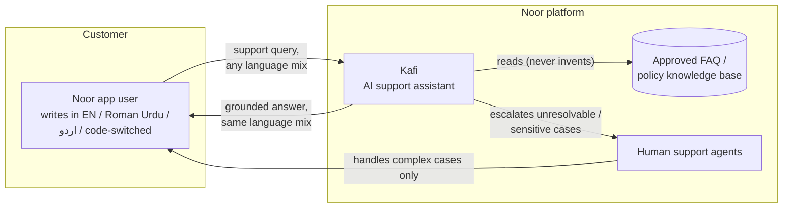
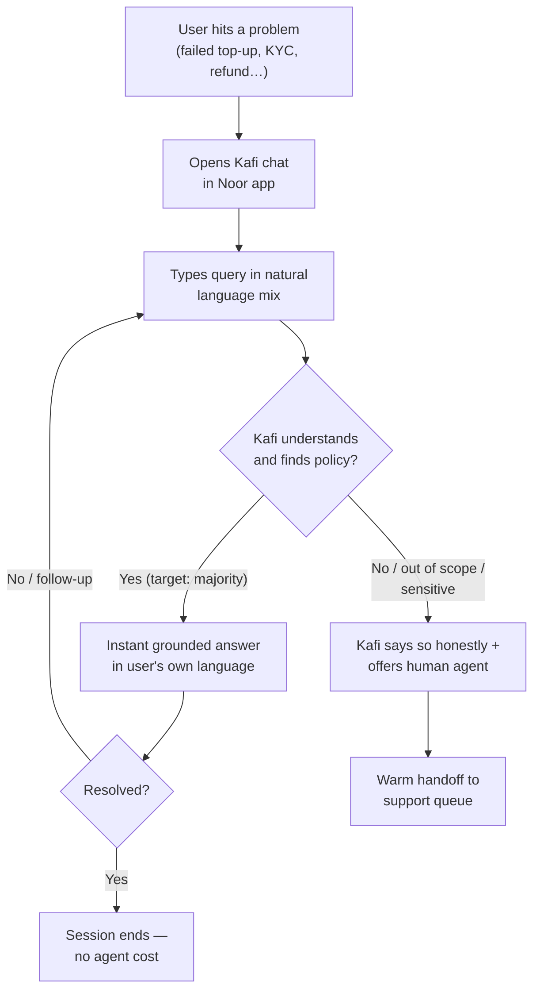

# Business Requirements Document (BRD)

## Kafi — AI Customer Support Assistant for Noor

<table>
  <tbody>
    <tr><td><strong>Document</strong></td><td>Business Requirements Document</td></tr>
    <tr><td><strong>Product</strong></td><td>Kafi (کافی) — in-app AI support assistant</td></tr>
    <tr><td><strong>Company</strong></td><td>Noor Digital (Pvt.) Ltd. — consumer mobile wallet, Pakistan</td></tr>
    <tr><td><strong>Version</strong></td><td>1.0</td></tr>
    <tr><td><strong>Date</strong></td><td>July 2026</td></tr>
    <tr><td><strong>Status</strong></td><td>Approved</td></tr>
    <tr><td><strong>Note</strong></td><td>Noor is a fictional company; this document is a portfolio artifact written as a realistic BRD for the deployed Kafi system.</td></tr>
  </tbody>
</table>

---

## 1. Executive summary

Noor operates a consumer mobile wallet serving 2.4M active users across Pakistan. Customer support is the company's largest operational cost center after payment processing, and its most persistent quality problem: support demand is growing linearly with the user base, while resolution quality is capped by agent availability and language friction.

Kafi is an AI support assistant embedded in the Noor app that resolves routine support queries instantly, in the language the customer actually writes — English, Roman Urdu, Urdu script, or the code-switched mix that dominates real Pakistani chat traffic. Answers are grounded in Noor's approved FAQ knowledge base rather than model memory, making responses auditable and policy-accurate.

This document defines the business context, objectives, scope, and requirements for Kafi's first production release.

## 2. Business context

### 2.1 The market reality

Pakistani digital-wallet users do not write support queries in a single language. Observed traffic across in-app chat, WhatsApp, and IVR transcripts shows three overlapping writing systems:

- **Roman Urdu** — Urdu written in Latin script, with no standardized spelling ("kahan" / "kaha" / "khan" for the same word)
- **English** — often informal, typo-heavy, written on mobile keyboards
- **Code-switched** — both languages mixed within a single sentence ("yaar mera top-up fail hogaya, refund kab milega?"), the single largest category
- **Urdu script (اردو)** — a smaller but meaningful segment, skewing older and more formal

Every incumbent support channel forces users out of this natural register: IVR menus are Urdu-formal, canned chat macros are English-formal, and existing chatbot products in the market handle only one language at a time. The result is a support experience that feels foreign to the customer in their own product.

### 2.2 The cost reality

<table>
  <thead>
    <tr><th>Driver</th><th>Current state</th></tr>
  </thead>
  <tbody>
    <tr><td>Support contact volume</td><td>Grows ~linearly with wallet growth</td></tr>
    <tr><td>Top contact drivers</td><td>Transaction status, top-up failures, KYC/verification, refunds — overwhelmingly routine and policy-answerable</td></tr>
    <tr><td>Human agent cost</td><td>Fixed per-seat; peak-hour queues degrade CSAT</td></tr>
    <tr><td>Off-hours coverage</td><td>Skeleton staffing; queries queue overnight</td></tr>
    <tr><td>Language routing</td><td>Agents triage language manually before resolving</td></tr>
  </tbody>
</table>

An estimated majority of contacts are questions whose answers already exist verbatim in Noor's internal FAQ/policy documentation. These contacts do not need a human — they need the existing answer, delivered instantly, in the customer's own language.

### 2.3 Why now

- Noor's FAQ/policy corpus is mature and centrally maintained (single source of truth exists).
- LLM capability in low-resource language handling (Roman Urdu normalization) has crossed the usability threshold at commodity prices.
- Retrieval-augmented generation (RAG) allows AI answers to be **grounded in approved policy text**, addressing the compliance objection that blocked earlier chatbot proposals.

## 3. Problem statement

> Noor customers cannot get instant, accurate support in the language they actually write. Routine policy questions — the majority of all contacts — wait in human queues, cost agent time, and are answered in a register (formal English or formal Urdu) that does not match how customers communicate. There is no self-service channel that understands code-switched Roman Urdu.

## 4. Business objectives

<table>
  <thead>
    <tr><th width="80">#</th><th>Objective</th><th>Success measure</th></tr>
  </thead>
  <tbody>
    <tr><td>BO-1</td><td>Deflect routine support contacts from human agents</td><td>≥ 40% of chat-channel contacts resolved without agent handoff (first 6 months)</td></tr>
    <tr><td>BO-2</td><td>Serve customers in their own language</td><td>≥ 95% of replies delivered in the language/register of the incoming message</td></tr>
    <tr><td>BO-3</td><td>Answer only from approved policy</td><td>100% of factual claims traceable to a knowledge-base entry; zero invented amounts/timeframes in QA sampling</td></tr>
    <tr><td>BO-4</td><td>Provide 24/7 instant first response</td><td>Median first-response &lt; 10 seconds at any hour</td></tr>
    <tr><td>BO-5</td><td>Preserve escalation quality</td><td>Every unresolvable query offered a human-agent path; no dead ends</td></tr>
  </tbody>
</table>

## 5. Product vision

Kafi is not a widget bolted onto the app — it is a named, branded assistant persona **inside** the Noor app (the "Erica by Bank of America" pattern). The name Kafi (کافی) references the Sufi poetic form written in the mixed vernacular of ordinary speech — the brand promise in one word: *we speak the way you speak.*

## 6. Users and personas

Drawn from Noor's observed support traffic (and encoded in the project's synthetic dataset):

<table>
  <thead>
    <tr><th>Persona</th><th>Profile</th><th>Typical query style</th></tr>
  </thead>
  <tbody>
    <tr><td><strong>Student</strong></td><td>18–24, high app fluency, low balance, frequent top-ups</td><td>Casual code-switched, heavy abbreviation ("nhi", "rha"), typos</td></tr>
    <tr><td><strong>Salaried</strong></td><td>25–45, salary disbursement + bills</td><td>Mixed; more English at work hours</td></tr>
    <tr><td><strong>Freelancer</strong></td><td>Receives foreign payments, fee-sensitive</td><td>English-leaning, precise, fee/limit questions</td></tr>
    <tr><td><strong>Small business owner</strong></td><td>High transaction count, agent/settlement queries</td><td>Roman Urdu-leaning, urgent tone</td></tr>
    <tr><td><strong>Senior citizen</strong></td><td>Lower app fluency, verification struggles</td><td>Urdu script or formal Roman Urdu, needs step-by-step</td></tr>
  </tbody>
</table>

## 7. User journey

## 8. Scope

### 8.1 In scope (this release)

<table>
  <thead>
    <tr><th width="80">ID</th><th>Capability</th></tr>
  </thead>
  <tbody>
    <tr><td>S-1</td><td>In-app chat interface with Kafi persona (branded, native-feeling screen)</td></tr>
    <tr><td>S-2</td><td>Understanding of English, Roman Urdu, Urdu script, and code-switched queries, including typos and non-standard transliteration</td></tr>
    <tr><td>S-3</td><td>Answers grounded exclusively in the approved FAQ knowledge base (10 support categories: verification, transactions, refunds, top-ups, KYC/CNIC, login/security, fees/limits, fraud, escalation, app issues)</td></tr>
    <tr><td>S-4</td><td>Language mirroring — reply in the language/register of the incoming message</td></tr>
    <tr><td>S-5</td><td>Short conversational memory within a session (follow-up questions resolve correctly)</td></tr>
    <tr><td>S-6</td><td>Small-talk handling (greetings/thanks/sign-offs answered naturally, without injecting support content)</td></tr>
    <tr><td>S-7</td><td>Honest refusal + human-escalation offer when the knowledge base lacks an answer</td></tr>
    <tr><td>S-8</td><td>Public marketing/landing page presenting Noor and Kafi</td></tr>
    <tr><td>S-9</td><td>Measurable retrieval quality: an offline evaluation harness with ground-truth-linked test queries</td></tr>
  </tbody>
</table>

### 8.2 Out of scope (this release)

<table>
  <thead>
    <tr><th width="80">ID</th><th>Exclusion</th><th>Rationale / future path</th></tr>
  </thead>
  <tbody>
    <tr><td>O-1</td><td>Account-specific actions (balance lookup, transaction status by ID, blocking cards)</td><td>Requires authenticated core-banking integration; phase 2</td></tr>
    <tr><td>O-2</td><td>Persistent conversation history across sessions/devices</td><td>Requires accounts + server-side session storage</td></tr>
    <tr><td>O-3</td><td>Live agent chat integration (real queue handoff)</td><td>Kafi offers escalation; actual routing is phase 2</td></tr>
    <tr><td>O-4</td><td>Voice (IVR) channel</td><td>Text-first release</td></tr>
    <tr><td>O-5</td><td>Streaming (token-by-token) replies</td><td>Answers are short; typing indicator suffices; revisit with scale</td></tr>
    <tr><td>O-6</td><td>Collection or storage of personal data</td><td>Deliberate: stateless server, no PII retention</td></tr>
  </tbody>
</table>

## 9. Business requirements

<table>
  <thead>
    <tr><th width="80">ID</th><th>Requirement</th><th>Priority</th><th>Traces to</th></tr>
  </thead>
  <tbody>
    <tr><td>BR-01</td><td>Kafi shall answer support questions using only content from the approved knowledge base, never invented policy details</td><td>Must</td><td>BO-3</td></tr>
    <tr><td>BR-02</td><td>Kafi shall understand queries in English, Roman Urdu, Urdu script, and any code-switched mix, tolerant of typos and spelling variance</td><td>Must</td><td>BO-2</td></tr>
    <tr><td>BR-03</td><td>Kafi shall reply in the same language/register the user wrote in</td><td>Must</td><td>BO-2</td></tr>
    <tr><td>BR-04</td><td>Kafi shall respond to any query within seconds, 24/7, without human involvement</td><td>Must</td><td>BO-1, BO-4</td></tr>
    <tr><td>BR-05</td><td>When the knowledge base cannot answer, Kafi shall say so plainly and offer a human agent — never bluff</td><td>Must</td><td>BO-3, BO-5</td></tr>
    <tr><td>BR-06</td><td>Kafi shall handle conversational niceties (greetings, thanks, goodbyes) briefly and naturally, without volunteering unrelated support content</td><td>Should</td><td>BO-2</td></tr>
    <tr><td>BR-07</td><td>Kafi shall resolve follow-up questions using recent conversation context within a session</td><td>Should</td><td>BO-1</td></tr>
    <tr><td>BR-08</td><td>Retrieval quality shall be measurable offline against ground truth before any knowledge-base or model change ships</td><td>Must</td><td>BO-3</td></tr>
    <tr><td>BR-09</td><td>The system shall store no customer personal data server-side</td><td>Must</td><td>Compliance posture</td></tr>
    <tr><td>BR-10</td><td>Kafi shall present as a branded persona within the Noor product, with a public page explaining the capability</td><td>Should</td><td>Brand</td></tr>
    <tr><td>BR-11</td><td>Operating cost shall fit within the free tiers of the selected LLM/hosting providers for demo-scale traffic</td><td>Must</td><td>Budget constraint</td></tr>
  </tbody>
</table>

## 10. Success metrics & acceptance

<table>
  <thead>
    <tr><th>Metric</th><th>Target</th><th>Measured how</th></tr>
  </thead>
  <tbody>
    <tr><td>Retrieval top-3 accuracy (offline eval, 1,000 ground-truth queries)</td><td>≥ 95%</td><td>Eval harness, <code>retrieval_only</code> mode — <strong>achieved: 99.0%</strong></td></tr>
    <tr><td>Retrieval top-1 accuracy</td><td>≥ 90%</td><td>Eval harness — <strong>achieved: 94.0%</strong></td></tr>
    <tr><td>Language-mirroring correctness</td><td>≥ 95%</td><td>Full-mode eval (detection vs. ground truth) + manual QA</td></tr>
    <tr><td>Typo robustness</td><td>No significant accuracy gap typo vs. clean</td><td>Eval segmentation — <strong>achieved: gap negligible</strong></td></tr>
    <tr><td>Small-talk containment</td><td>0 unsolicited support topics in sign-off replies</td><td>Manual QA scripts</td></tr>
    <tr><td>First-response latency</td><td>&lt; 10 s median (cold-start excepted)</td><td>Production observation</td></tr>
  </tbody>
</table>

## 11. Constraints

<table>
  <thead>
    <tr><th width="80">#</th><th>Constraint</th><th>Consequence</th></tr>
  </thead>
  <tbody>
    <tr><td>C-1</td><td>LLM free tier: 15 requests/min, 500 requests/day</td><td>Caps daily conversation volume (~250 messages/day at 2 calls each); rate limiting + retry required</td></tr>
    <tr><td>C-2</td><td>Zero-budget hosting (free tiers)</td><td>Backend sleeps when idle → cold-start latency up to ~60 s on first request</td></tr>
    <tr><td>C-3</td><td>Embeddings must not consume API quota</td><td>Solved via local CPU embedding model (no external calls)</td></tr>
    <tr><td>C-4</td><td>No PII storage permitted</td><td>Conversation memory must be client-held; server stateless</td></tr>
    <tr><td>C-5</td><td>Fictional-entity clarity</td><td>All public surfaces must disclose Noor is not a real financial service</td></tr>
  </tbody>
</table>

## 12. Assumptions

- A-1: The FAQ knowledge base (~100 entries, 10 categories) is accurate, non-redundant, and centrally maintained; Kafi's answer quality inherits from it.
- A-2: Synthetic query data (1,000+ examples across personas, languages, and typo rates) is a faithful proxy for real traffic distribution.
- A-3: The LLM provider's free tier remains available at current limits for the demo horizon.
- A-4: Users accept AI-labeled support for routine queries when quality is high and escalation is available.

## 13. Risks

<table>
  <thead>
    <tr><th width="80">#</th><th>Risk</th><th>Likelihood</th><th>Impact</th><th>Mitigation</th></tr>
  </thead>
  <tbody>
    <tr><td>R-1</td><td>LLM invents policy details (hallucination)</td><td>Medium</td><td>High</td><td>Grounded generation only; prompt forbids off-context claims; honest-refusal path (BR-05); QA sampling</td></tr>
    <tr><td>R-2</td><td>Language misclassification → reply in wrong language</td><td>Medium</td><td>Medium</td><td>Deterministic guards (script detection, lexicon check) override the LLM; measured in eval</td></tr>
    <tr><td>R-3</td><td>Retrieval returns wrong FAQ → confidently wrong answer</td><td>Medium</td><td>High</td><td>99% top-3 measured; weakest category tracked (account_verification, 80% top-1) with data-repair backlog</td></tr>
    <tr><td>R-4</td><td>Daily LLM quota exhausted by traffic spike</td><td>Medium</td><td>Medium</td><td>Rate limiter + graceful error message; paid tier is the scale path</td></tr>
    <tr><td>R-5</td><td>Users type real PII into a demo system</td><td>Medium</td><td>Medium</td><td>Privacy page instructs against it; no server-side storage; disclosure in footer</td></tr>
    <tr><td>R-6</td><td>Cold-start latency read as "broken"</td><td>High (free tier)</td><td>Low</td><td>Health-check warm-up before demos; documented behavior</td></tr>
  </tbody>
</table>

## 14. Glossary

<table>
  <thead>
    <tr><th>Term</th><th>Meaning</th></tr>
  </thead>
  <tbody>
    <tr><td><strong>Code-switching</strong></td><td>Mixing two languages within one utterance</td></tr>
    <tr><td><strong>Roman Urdu</strong></td><td>Urdu written in Latin characters, spelling unstandardized</td></tr>
    <tr><td><strong>RAG</strong></td><td>Retrieval-Augmented Generation — LLM answers grounded in retrieved reference text</td></tr>
    <tr><td><strong>Knowledge base (KB)</strong></td><td>Noor's approved FAQ/policy corpus, the sole source of factual answers</td></tr>
    <tr><td><strong>Deflection</strong></td><td>A support contact resolved without a human agent</td></tr>
    <tr><td><strong>Normalization</strong></td><td>Rewriting a raw user query into clean English for retrieval</td></tr>
  </tbody>
</table>

---

*Related documents: [FSD.md](FSD.md) — Functional Specification · [TSD.md](TSD.md) — Technical Specification*
