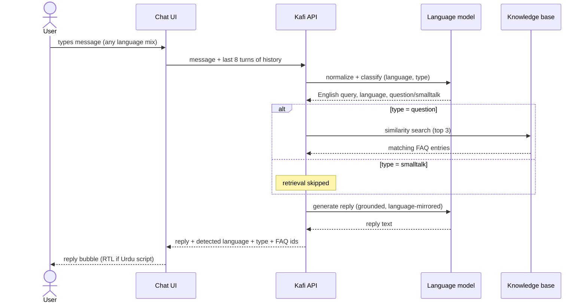
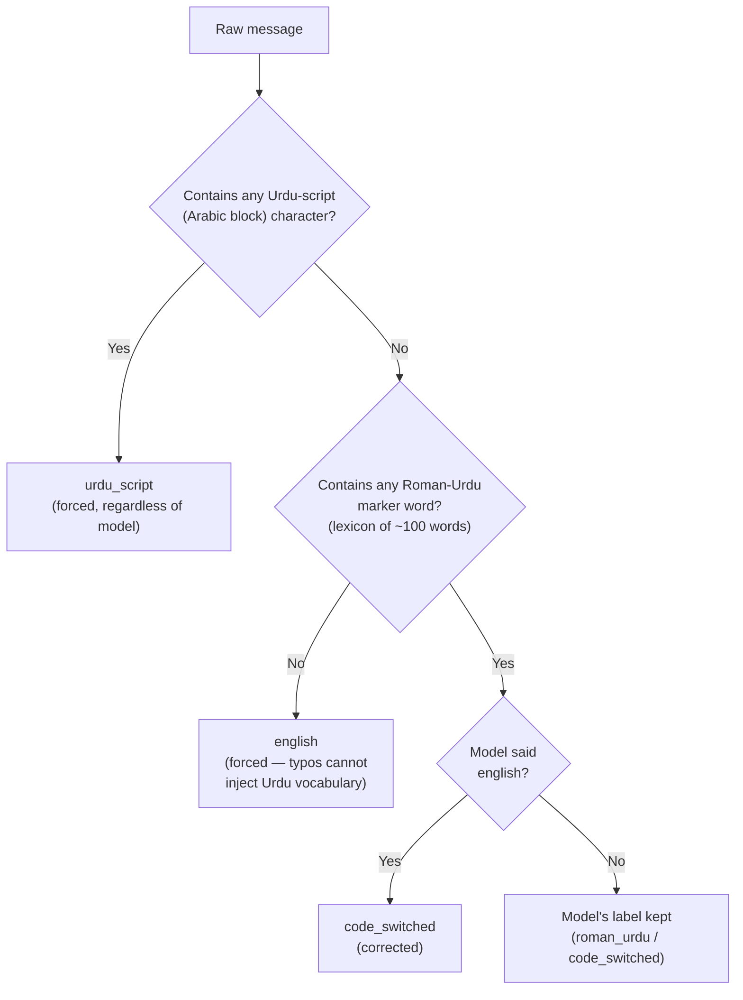
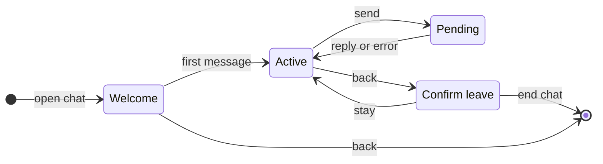

# Functional Specification Document (FSD)

## Kafi — AI Customer Support Assistant for Noor

<table>
  <tbody>
    <tr><td><strong>Document</strong></td><td>Functional Specification Document</td></tr>
    <tr><td><strong>Product</strong></td><td>Kafi (کافی) — in-app AI support assistant</td></tr>
    <tr><td><strong>Version</strong></td><td>1.0</td></tr>
    <tr><td><strong>Date</strong></td><td>July 2026</td></tr>
    <tr><td><strong>Status</strong></td><td>Approved</td></tr>
    <tr><td><strong>Upstream</strong></td><td><a href="BRD.md">BRD.md</a> — business requirements this document refines</td></tr>
    <tr><td><strong>Downstream</strong></td><td><a href="TSD.md">TSD.md</a> — technical design implementing this specification</td></tr>
    <tr><td><strong>Note</strong></td><td>Noor is a fictional company; this document is a portfolio artifact describing the deployed Kafi system's actual behavior.</td></tr>
  </tbody>
</table>

---

## 1. Purpose and audience

This document specifies **what the Kafi system does**, feature by feature, in observable terms: inputs, behavior, outputs, and acceptance criteria. It is written for product, QA, and engineering; the *how* (architecture, prompts, schemas, infrastructure) lives in the [TSD](TSD.md).

Functional requirements are numbered `FR-x.y` and trace to the BRD's business requirements (`BR-nn`).

## 2. System overview

Kafi comprises three user-facing surfaces and one operator-facing capability:

<table>
  <thead>
    <tr><th width="80">Area</th><th>Surface</th><th>Summary</th></tr>
  </thead>
  <tbody>
    <tr><td>F-1…F-6</td><td>Chat experience</td><td>The conversation itself: understanding, answering, language mirroring, context, session lifecycle</td></tr>
    <tr><td>F-7</td><td>Chat interface</td><td>The in-app chat screen: layout, states, animations, accessibility</td></tr>
    <tr><td>F-8</td><td>Landing page</td><td>Noor's public marketing page, entry point to the chat</td></tr>
    <tr><td>F-9</td><td>Error handling</td><td>Degraded-mode behavior across surfaces</td></tr>
    <tr><td>F-10</td><td>Evaluation harness</td><td>Offline measurement of retrieval and language-detection quality</td></tr>
  </tbody>
</table>

### 2.1 Core message flow

## 3. Actors

<table>
  <thead>
    <tr><th width="80">Actor</th><th>Description</th></tr>
  </thead>
  <tbody>
    <tr><td>User</td><td>Noor app customer seeking support; writes in English, Roman Urdu, Urdu script, or a mix; anonymous (no login)</td></tr>
    <tr><td>Kafi</td><td>The AI assistant persona; the only responder in chat</td></tr>
    <tr><td>Operator</td><td>Engineer/analyst running the evaluation harness and maintaining the knowledge base</td></tr>
  </tbody>
</table>

## 4. F-1: Query understanding

Every incoming message is normalized and classified in a single step before any answering happens.

<table>
  <thead>
    <tr><th width="80">ID</th><th>Requirement</th><th>Acceptance criteria</th><th>Traces</th></tr>
  </thead>
  <tbody>
    <tr><td>FR-1.1</td><td>The system shall accept free-text messages in English, Roman Urdu, Urdu script, or any code-switched mix, including typos, texting abbreviations ("nhi", "rha"), and non-standard transliteration</td><td>Queries from all four language classes in the 1,000-row test set process without error</td><td>BR-02</td></tr>
    <tr><td>FR-1.2</td><td>Each message shall be internally rewritten as a single, self-contained plain-English query used for knowledge-base search</td><td>Normalized query visible in API response (<code>normalized_query</code>); meaning preserved per QA sampling</td><td>BR-02</td></tr>
    <tr><td>FR-1.3</td><td>Each message shall be classified by language: <code>english</code>, <code>roman_urdu</code>, <code>code_switched</code>, or <code>urdu_script</code></td><td><code>detected_language</code> returned on every reply; accuracy measured in full-mode eval</td><td>BR-03 (BRD BO-2)</td></tr>
    <tr><td>FR-1.4</td><td>Each message shall be classified by type: <code>question</code> (asks for help/information or reports a problem) or <code>smalltalk</code> (greeting, thanks, acknowledgement, goodbye with no support content)</td><td><code>message_type</code> returned on every reply; QA script of 20 sign-off phrases classifies ≥ 19 as smalltalk</td><td>BR-06</td></tr>
    <tr><td>FR-1.5</td><td>Language classification shall be deterministically corrected where rules can outperform the model (see 4.1)</td><td>Guard unit behavior per decision table below</td><td>BR-03</td></tr>
  </tbody>
</table>

### 4.1 Language decision rules

The model's language label passes through deterministic guards, in order:

<table>
  <thead>
    <tr><th width="80">Rule</th><th>Condition</th><th>Outcome</th><th>Rationale</th></tr>
  </thead>
  <tbody>
    <tr><td>G-1</td><td>Message contains ≥ 1 character in the Arabic Unicode block</td><td><code>urdu_script</code>, unconditionally</td><td>Script detection is a character-range check; zero ambiguity</td></tr>
    <tr><td>G-2</td><td>Latin-only message with zero Roman-Urdu marker words</td><td><code>english</code>, unconditionally</td><td>Typo-heavy English was misclassified as Urdu by the model; typos cannot create Urdu vocabulary</td></tr>
    <tr><td>G-3</td><td>Model says <code>english</code> but Urdu markers present</td><td><code>code_switched</code></td><td>Inverse failure of G-2</td></tr>
  </tbody>
</table>

The marker lexicon deliberately excludes spellings that are valid English words ("do", "is", "us", "main") so English text cannot false-positive.

## 5. F-2: Grounded answering

<table>
  <thead>
    <tr><th width="80">ID</th><th>Requirement</th><th>Acceptance criteria</th><th>Traces</th></tr>
  </thead>
  <tbody>
    <tr><td>FR-2.1</td><td>For <code>question</code> messages, the system shall retrieve the 3 most similar knowledge-base entries for the normalized query and generate the reply grounded in them</td><td><code>retrieved_faq_ids</code> lists exactly the entries used; retrieval accuracy per F-10 targets</td><td>BR-01</td></tr>
    <tr><td>FR-2.2</td><td>Replies shall never state amounts, timeframes, or policy details absent from the retrieved entries</td><td>QA sampling: zero invented policy facts</td><td>BR-01</td></tr>
    <tr><td>FR-2.3</td><td>Replies shall use only the retrieved content relevant to what was asked, and shall not volunteer other topics present in the retrieved context</td><td>QA: answers to single-topic questions contain no second topic</td><td>BR-01, BR-06</td></tr>
    <tr><td>FR-2.4</td><td>When retrieved content cannot answer the question, Kafi shall say so plainly in the user's language and offer a human agent</td><td>Out-of-scope probe set (e.g. "dark mode kaise enable karun?") produces honest refusal + escalation offer, no fabrication</td><td>BR-05</td></tr>
    <tr><td>FR-2.5</td><td>Replies shall be concise, chat-register messages, not essays</td><td>QA: median reply ≤ ~120 words</td><td>BR-04</td></tr>
  </tbody>
</table>

## 6. F-3: Language mirroring

<table>
  <thead>
    <tr><th width="80">ID</th><th>Requirement</th><th>Acceptance criteria</th><th>Traces</th></tr>
  </thead>
  <tbody>
    <tr><td>FR-3.1</td><td>The reply language shall follow the detected language of the <em>latest</em> user message per the matrix below</td><td>Mirroring matrix satisfied on QA script covering all four classes</td><td>BR-03</td></tr>
    <tr><td>FR-3.2</td><td>A fully-English message shall receive a fully-English reply — no Roman Urdu words or phrases</td><td>English probe set (incl. typo-heavy variants) yields 100% English replies</td><td>BR-03</td></tr>
    <tr><td>FR-3.3</td><td>Urdu-script messages shall receive Urdu-script replies, rendered right-to-left in the UI</td><td>Script probe yields script replies; bubbles lay out RTL</td><td>BR-02, BR-03</td></tr>
    <tr><td>FR-3.4</td><td>Roman Urdu and code-switched replies shall never use Urdu (Arabic) script</td><td>QA: zero script characters in Latin-class replies</td><td>BR-03</td></tr>
  </tbody>
</table>

### 6.1 Mirroring matrix

<table>
  <thead>
    <tr><th>User writes</th><th>Kafi replies</th><th>Register notes</th></tr>
  </thead>
  <tbody>
    <tr><td>English (incl. typo-heavy)</td><td>English only</td><td>Match casual/formal tone of user</td></tr>
    <tr><td>Roman Urdu</td><td>Roman Urdu (Latin script)</td><td>Common English fintech terms (app, transaction, refund) permitted where natural</td></tr>
    <tr><td>Code-switched</td><td>Same natural mix</td><td>Neither stiff English nor formal Urdu</td></tr>
    <tr><td>Urdu script (اردو)</td><td>Urdu script</td><td>Warm and clear, not literary; UI renders RTL</td></tr>
  </tbody>
</table>

## 7. F-4: Small-talk handling

<table>
  <thead>
    <tr><th width="80">ID</th><th>Requirement</th><th>Acceptance criteria</th><th>Traces</th></tr>
  </thead>
  <tbody>
    <tr><td>FR-4.1</td><td>Messages classified <code>smalltalk</code> shall bypass knowledge-base retrieval entirely</td><td><code>retrieved_faq_ids</code> is empty for smalltalk replies</td><td>BR-06</td></tr>
    <tr><td>FR-4.2</td><td>Smalltalk replies shall be brief, friendly, and language-mirrored</td><td>QA: sign-offs answered in ≤ 2 sentences, correct language</td><td>BR-06, BR-03</td></tr>
    <tr><td>FR-4.3</td><td>Smalltalk replies may acknowledge a topic already discussed in the session, but shall never introduce a support topic the user did not raise</td><td>QA: "will try" after a verification thread may reference verification; "will try" in a fresh session references nothing</td><td>BR-06</td></tr>
  </tbody>
</table>

## 8. F-5: Conversational context

<table>
  <thead>
    <tr><th width="80">ID</th><th>Requirement</th><th>Acceptance criteria</th><th>Traces</th></tr>
  </thead>
  <tbody>
    <tr><td>FR-5.1</td><td>The client shall send the most recent turns (up to 8 messages) with each request; the server shall additionally enforce the same cap</td><td>Request payload inspection; server truncates oversized histories</td><td>BR-07, BR-09</td></tr>
    <tr><td>FR-5.2</td><td>Follow-up questions shall resolve against recent context into self-contained queries (e.g. "aur agar phir bhi fail ho?" after a top-up thread → a top-up-failure query)</td><td>Follow-up QA set retrieves same-category FAQs as the thread topic</td><td>BR-07</td></tr>
    <tr><td>FR-5.3</td><td>Language and type classification shall consider only the latest message, not history</td><td>An English follow-up inside an Urdu thread gets an English reply</td><td>BR-03</td></tr>
    <tr><td>FR-5.4</td><td>No conversation content shall be stored server-side; leaving the chat (or refreshing) permanently ends the session</td><td>No persistence layer exists; new visit starts with only the welcome message</td><td>BR-09</td></tr>
  </tbody>
</table>

## 9. F-6: Session lifecycle

<table>
  <thead>
    <tr><th width="80">ID</th><th>Requirement</th><th>Acceptance criteria</th><th>Traces</th></tr>
  </thead>
  <tbody>
    <tr><td>FR-6.1</td><td>A new session shall open with a bilingual welcome message (English first, Roman Urdu second) inviting queries in any language</td><td>Welcome bubble present on every fresh load</td><td>BR-10</td></tr>
    <tr><td>FR-6.2</td><td>If the user taps back with at least one exchange in the session, the system shall show a confirmation dialog explaining the session will end and not be remembered</td><td>Dialog appears only when messages beyond the welcome exist</td><td>BR-09 (transparency)</td></tr>
    <tr><td>FR-6.3</td><td>If no conversation exists (welcome only), back shall navigate immediately without confirmation</td><td>No dialog on empty session</td><td>UX</td></tr>
    <tr><td>FR-6.4</td><td>The dialog shall offer "Stay" (dismiss, also via backdrop tap) and "End chat" (navigate home); both entrance and exit shall be animated</td><td>Open: fade+pop in; close: reverse fade/pop before unmount; End chat leaves via the route transition</td><td>UX</td></tr>
  </tbody>
</table>

## 10. F-7: Chat interface

<table>
  <thead>
    <tr><th width="80">ID</th><th>Requirement</th><th>Acceptance criteria</th><th>Traces</th></tr>
  </thead>
  <tbody>
    <tr><td>FR-7.1</td><td>The chat shall present as a native screen of the Noor app: branded header (Kafi avatar with کافی wordmark, "Kafi / AI Assistant"), message list, input bar — full-screen on mobile, phone-frame card on desktop</td><td>Visual QA both breakpoints</td><td>BR-10</td></tr>
    <tr><td>FR-7.2</td><td>User and assistant messages shall render as visually distinct bubbles; each bubble sets text direction automatically so Urdu script lays out RTL</td><td><code>dir="auto"</code> behavior verified with script replies</td><td>BR-02</td></tr>
    <tr><td>FR-7.3</td><td>While a reply is pending, a typing indicator (three bouncing dots) shall show and the input shall be disabled</td><td>Indicator visible during request; input re-enables on completion</td><td>BR-04</td></tr>
    <tr><td>FR-7.4</td><td>The message list shall auto-scroll to the newest message and use a slim, theme-matched scrollbar</td><td>Scroll follows new bubbles; scrollbar styled in supported browsers</td><td>UX</td></tr>
    <tr><td>FR-7.5</td><td>The input placeholder shall alternate between "Apna sawal likhein..." and "Type your query...", each typed in character-by-character, held ~2 s, then erased</td><td>Animation cycles continuously while input is empty</td><td>BR-10</td></tr>
    <tr><td>FR-7.6</td><td>Navigation from the landing hero to the chat shall morph the hero's phone mockup into the chat screen (shared-element transition) when the mockup is on screen; all other navigations shall cross-fade. On arrival the chat shall land at mockup size, then expand to full height</td><td>Morph fires only with hero visible (≥ 40% in viewport); two-phase entrance observable; non-supporting browsers degrade to instant navigation</td><td>BR-10</td></tr>
  </tbody>
</table>

## 11. F-8: Landing page

<table>
  <thead>
    <tr><th width="80">ID</th><th>Requirement</th><th>Acceptance criteria</th><th>Traces</th></tr>
  </thead>
  <tbody>
    <tr><td>FR-8.1</td><td>The landing page shall present Noor as a consumer fintech: sticky nav, hero with live-looking Kafi mockup, stats strip, features grid, "how Kafi works" section, open-source suite section, footer</td><td>All sections render; nav anchors scroll smoothly to sections</td><td>BR-10</td></tr>
    <tr><td>FR-8.2</td><td>Every chat CTA (nav, hero, Kafi section, footer) shall lead to the chat screen</td><td>All four CTAs navigate to <code>/chat</code></td><td>BR-10</td></tr>
    <tr><td>FR-8.3</td><td>The features section shall present six wallet capabilities in a mixed-size (bento) grid with per-feature proof-point chips, and a virtual-card visual (scroll-linked entrance/exit, cursor-tracking tilt, spec annotations on desktop)</td><td>Visual QA; card animations smooth; annotations hidden below desktop widths</td><td>BR-10</td></tr>
    <tr><td>FR-8.4</td><td>The suite section shall present RedPen, Lumen, and Prism as Noor's open-sourced internal tools, each card linking to its GitHub repository and live demo</td><td>Six links resolve (3 × GitHub, 3 × demo)</td><td>BR-10</td></tr>
    <tr><td>FR-8.5</td><td>The footer shall carry the fictional-company disclaimer and link to a combined Privacy &amp; Terms page, which shall disclose demo status, the LLM data flow, and warn against entering real personal data</td><td>Disclaimer present; /privacy reachable; terms anchor scrolls correctly</td><td>BR-09, C-5</td></tr>
  </tbody>
</table>

## 12. F-9: Error handling and degraded modes

<table>
  <thead>
    <tr><th width="80">ID</th><th>Condition</th><th>Required behavior</th><th>Traces</th></tr>
  </thead>
  <tbody>
    <tr><td>FR-9.1</td><td>Chat API request fails (network error or non-200)</td><td>Apologetic retry-invite bubble in code-switched register ("Maazrat, kuch masla ho gaya…"); input re-enabled; conversation preserved client-side</td><td>BR-04</td></tr>
    <tr><td>FR-9.2</td><td>LLM rate limit hit (429)</td><td>Server retries with exponential backoff (up to 5 attempts) before failing; user sees only increased latency or FR-9.1</td><td>C-1</td></tr>
    <tr><td>FR-9.3</td><td>Model returns malformed classification output</td><td>Defensive parse: fall back to <code>code_switched</code> / <code>question</code> and treat full text as the normalized query; never crash</td><td>BR-04</td></tr>
    <tr><td>FR-9.4</td><td>Backend cold start (free-tier sleep)</td><td>First request may take up to ~60 s; UI keeps typing indicator; no timeout below 90 s</td><td>C-2</td></tr>
    <tr><td>FR-9.5</td><td>Unknown client-side route</td><td>SPA fallback serves the app shell (no hosting 404) for <code>/chat</code>, <code>/privacy</code> deep links and refreshes</td><td>BR-10</td></tr>
  </tbody>
</table>

## 13. F-10: Evaluation harness (operator-facing)

<table>
  <thead>
    <tr><th width="80">ID</th><th>Requirement</th><th>Acceptance criteria</th><th>Traces</th></tr>
  </thead>
  <tbody>
    <tr><td>FR-10.1</td><td>The harness shall score retrieval against the 1,000-query synthetic set, where each query carries a ground-truth FAQ id</td><td>Per-row results CSV + summary report produced</td><td>BR-08</td></tr>
    <tr><td>FR-10.2</td><td>Two modes shall isolate the pipeline's failure points: <code>retrieval_only</code> (ground-truth English queries, no LLM, free, full dataset) and <code>full</code> (real normalization, quota-limited, stratified sample)</td><td>Both modes runnable from CLI with mode/sample/worker flags</td><td>BR-08</td></tr>
    <tr><td>FR-10.3</td><td>Reported metrics shall include top-1/top-3 accuracy, category accuracy, and breakdowns by query language, typo flag, and intent (worst 5)</td><td>Summary output contains all segments</td><td>BR-08</td></tr>
    <tr><td>FR-10.4</td><td>Full mode shall additionally score language detection against ground-truth labels</td><td>Detection accuracy printed when available</td><td>BR-03</td></tr>
    <tr><td>FR-10.5</td><td>Full mode shall respect API quotas via pacing (thread-safe rate limiting) and stratified sampling sized to the daily budget</td><td>No 429 cascade on default settings</td><td>C-1</td></tr>
  </tbody>
</table>

### 13.1 Current measured results (acceptance baseline)

<table>
  <thead>
    <tr><th>Metric</th><th>Target (BRD §10)</th><th>Measured</th></tr>
  </thead>
  <tbody>
    <tr><td>Top-1 accuracy (1,000 rows)</td><td>≥ 90%</td><td><strong>94.0%</strong></td></tr>
    <tr><td>Top-3 accuracy</td><td>≥ 95%</td><td><strong>99.0%</strong></td></tr>
    <tr><td>Code-switched top-1 (hardest slice)</td><td>—</td><td>92.2%</td></tr>
    <tr><td>Typo vs. clean gap</td><td>Not significant</td><td>Negligible (94.2% vs 94.0%)</td></tr>
    <tr><td>Weakest category</td><td>Tracked</td><td><code>account_verification</code>, 80.0% top-1 (repair backlog)</td></tr>
  </tbody>
</table>

## 14. Explicitly out of functional scope

Per BRD §8.2: account-specific actions, cross-session persistence, live agent routing, voice, streaming replies, and any server-side storage of user content. A request touching these shall follow FR-2.4 (honest refusal + escalation offer) rather than fail silently.

---

*Previous: [BRD.md](BRD.md) — Business Requirements · Next: [TSD.md](TSD.md) — Technical Specification*
