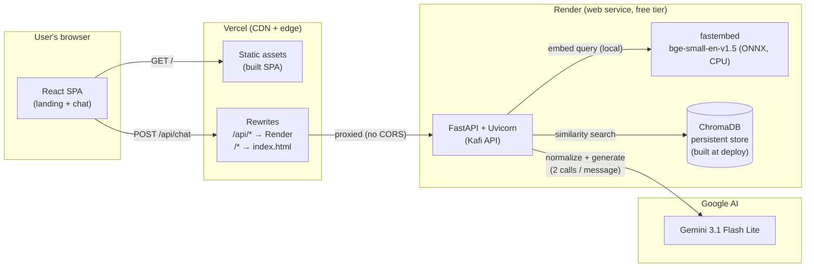
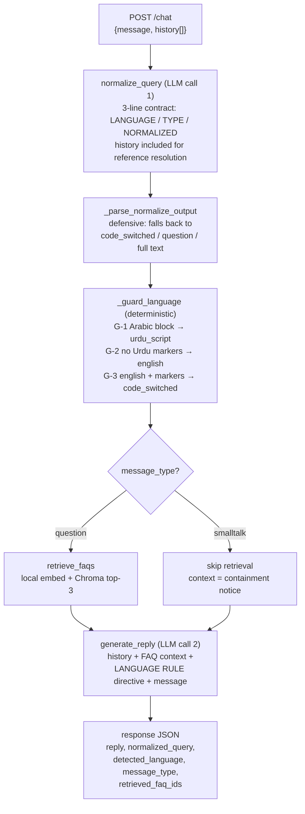
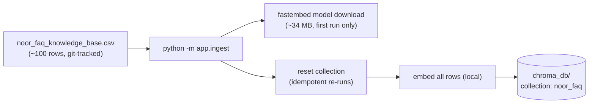
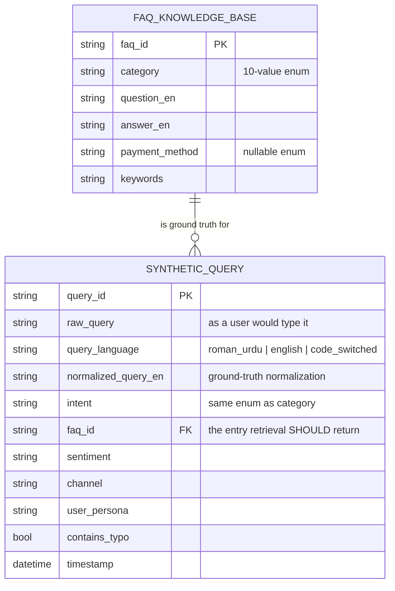

# Technical Specification Document (TSD)

## Kafi — AI Customer Support Assistant for Noor

<table>
  <tbody>
    <tr><td><strong>Document</strong></td><td>Technical Specification Document</td></tr>
    <tr><td><strong>Product</strong></td><td>Kafi (کافی) — in-app AI support assistant</td></tr>
    <tr><td><strong>Version</strong></td><td>1.0</td></tr>
    <tr><td><strong>Date</strong></td><td>July 2026</td></tr>
    <tr><td><strong>Status</strong></td><td>Approved</td></tr>
    <tr><td><strong>Upstream</strong></td><td><a href="BRD.md">BRD.md</a> — business requirements · <a href="FSD.md">FSD.md</a> — functional specification</td></tr>
    <tr><td><strong>Note</strong></td><td>Noor is a fictional company; this document is a portfolio artifact describing the deployed Kafi system as built.</td></tr>
  </tbody>
</table>

---

## 1. Purpose and audience

This document specifies **how Kafi is built**: architecture, component design, data schemas, API contracts, algorithms, and deployment. It is written for engineers. Functional behavior (the *what*) is defined in the [FSD](FSD.md); requirement IDs referenced here (`FR-x.y`, `BR-nn`) trace to it and to the [BRD](BRD.md).

## 2. System architecture

### 2.1 Deployment topology



Key properties:

<table>
  <thead>
    <tr><th width="80">#</th><th>Property</th><th>Consequence</th></tr>
  </thead>
  <tbody>
    <tr><td>T-1</td><td>The browser talks only to the Vercel origin; <code>/api/*</code> is rewritten server-side to Render</td><td>No CORS configuration anywhere; backend URL swappable without code changes</td></tr>
    <tr><td>T-2</td><td>Embeddings run in-process on the API host (CPU, ONNX)</td><td>Zero external calls and zero quota for retrieval; retrieval works even if the LLM quota is exhausted</td></tr>
    <tr><td>T-3</td><td>The vector store is built at deploy time, not runtime</td><td><code>chroma_db/</code> is not in git; every deploy re-ingests from the CSV source of truth</td></tr>
    <tr><td>T-4</td><td>The API is stateless — no database, no sessions</td><td>Conversation context is client-held (FR-5.x); horizontal scaling is trivial; nothing to leak</td></tr>
  </tbody>
</table>

### 2.2 Repository layout

```
Kafi/
├── backend/
│   ├── app/
│   │   ├── config.py        # pydantic-settings (env-driven)
│   │   ├── embeddings.py    # LocalEmbeddings (fastembed wrapper)
│   │   ├── ingest.py        # CSV → ChromaDB (deploy-time)
│   │   ├── pipeline.py      # normalize → guard → retrieve → generate
│   │   ├── eval.py          # offline evaluation harness
│   │   └── main.py          # FastAPI app / API contract
│   └── requirements.txt     # pinned
├── frontend/
│   ├── src/
│   │   ├── pages/           # Landing.jsx, Privacy.jsx
│   │   ├── components/      # ChatScreen, Header, MessageBubble, InputBar
│   │   ├── App.jsx          # data router (createBrowserRouter)
│   │   └── index.css        # Tailwind v4 theme + custom animation CSS
│   └── vercel.json          # rewrites (API proxy + SPA fallback)
├── data/
│   ├── noor_faq_knowledge_base.csv     # ~100 rows — the KB
│   └── noor_synthetic_queries.csv      # 1,000+ rows — eval ground truth
├── docs/                    # BRD / FSD / TSD (this document)
└── render.yaml              # Render Blueprint (backend service)
```

## 3. Technology stack

<table>
  <thead>
    <tr><th>Layer</th><th>Technology</th><th>Role</th></tr>
  </thead>
  <tbody>
    <tr><td>LLM</td><td>Google Gemini 3.1 Flash Lite (<code>gemini-3.1-flash-lite</code>), temperature 0.3</td><td>Query normalization + classification; grounded reply generation</td></tr>
    <tr><td>Embeddings</td><td>fastembed 0.8 · <code>BAAI/bge-small-en-v1.5</code> quantized ONNX, 384-dim, CPU</td><td>Query/document vectors for retrieval; ~34 MB, downloaded once to <code>model_cache/</code></td></tr>
    <tr><td>Vector store</td><td>ChromaDB 1.5 (persistent, cosine)</td><td>FAQ storage + top-k similarity search</td></tr>
    <tr><td>Orchestration</td><td>LangChain (core + chroma + google-genai integrations)</td><td>Uniform interfaces over LLM / embeddings / store</td></tr>
    <tr><td>API</td><td>FastAPI 0.138 + Uvicorn 0.49 + Pydantic</td><td>HTTP contract, validation, OpenAPI docs</td></tr>
    <tr><td>Resilience</td><td>tenacity 9</td><td>Exponential-backoff retries on 429/rate-limit errors</td></tr>
    <tr><td>Frontend</td><td>React 19 + Vite 6 + Tailwind CSS 4 + react-router 7 (data router)</td><td>SPA: landing, chat, privacy; View Transitions</td></tr>
    <tr><td>Hosting</td><td>Vercel (static + rewrites) · Render (Python web service)</td><td>Free-tier deployment (BR-11)</td></tr>
  </tbody>
</table>

## 4. Backend design

### 4.1 Pipeline

One user message triggers exactly two LLM calls and at most one local retrieval:



### 4.2 Normalization contract (LLM call 1)

The system prompt demands exactly three lines; parsing never trusts it:

<table>
  <thead>
    <tr><th width="120">Line</th><th>Contract</th><th>Parse fallback</th></tr>
  </thead>
  <tbody>
    <tr><td><code>LANGUAGE:</code></td><td>One of <code>english | roman_urdu | code_switched | urdu_script</code></td><td><code>code_switched</code> if absent/invalid</td></tr>
    <tr><td><code>TYPE:</code></td><td><code>question</code> (info/help/problem) or <code>smalltalk</code> (greeting/thanks/ack/goodbye)</td><td><code>question</code> if absent/invalid (safe default: retrieval runs)</td></tr>
    <tr><td><code>NORMALIZED:</code></td><td>Self-contained plain-English search query; history used to resolve references (FR-5.2)</td><td>Entire raw model output used as the query</td></tr>
  </tbody>
</table>

When history is present, the human message is framed as `CONVERSATION SO FAR:` + `LATEST USER MESSAGE:`; classification is instructed to consider the latest message only (FR-5.3).

### 4.3 Deterministic language guards

Applied to the raw message *after* the LLM's label, in order (FSD §4.1):

<table>
  <thead>
    <tr><th width="80">Guard</th><th>Implementation</th><th>Complexity</th></tr>
  </thead>
  <tbody>
    <tr><td>G-1</td><td>Regex match on the Arabic Unicode block (<code>[؀-ۿ]</code>) → <code>urdu_script</code></td><td>O(n), zero false positives for Latin text</td></tr>
    <tr><td>G-2</td><td>Tokenize Latin words; if intersection with a ~100-word Roman-Urdu marker lexicon is empty → <code>english</code>. Lexicon excludes valid English homographs ("do", "is", "us", "main") and includes texting shortenings ("nhi", "rha", "kro")</td><td>O(n) set lookups</td></tr>
    <tr><td>G-3</td><td>Model said <code>english</code> but markers present → <code>code_switched</code></td><td>—</td></tr>
  </tbody>
</table>

Design principle: **wherever a deterministic check can outperform the model, it overrides the model.** The LLM classifies the ambiguous middle (roman_urdu vs code_switched); the guards own the unambiguous edges.

### 4.4 Generation (LLM call 2)

Prompt assembly, in order:

1. **System prompt** — persona (Noor support), grounding rules (facts only from context; no volunteering unraised topics — FR-2.2/2.3), honesty rule (FR-2.4), conciseness (FR-2.5).
2. **`CONVERSATION SO FAR`** — formatted history (≤ 8 messages, `User:` / `Kafi:` lines), when present.
3. **`FAQ CONTEXT`** — the 3 retrieved entries; for smalltalk, a containment notice replaces it (brief acknowledgement; may reference discussed topics; introduce nothing new — FR-4.3).
4. **`LANGUAGE RULE`** — hard per-language directive selected by the guarded label (mirroring matrix, FSD §6.1).
5. **`USER'S LATEST MESSAGE`** — verbatim.

### 4.5 Resilience

<table>
  <thead>
    <tr><th width="80">#</th><th>Mechanism</th><th>Detail</th></tr>
  </thead>
  <tbody>
    <tr><td>RS-1</td><td>Retry with backoff</td><td>tenacity wraps each pipeline step: retry only on rate-limit signatures (429 / RESOURCE_EXHAUSTED), exponential wait 2–60 s, max 5 attempts, then re-raise (FR-9.2)</td></tr>
    <tr><td>RS-2</td><td>Defensive parsing</td><td>§4.2 fallbacks; a malformed LLM response degrades quality, never availability (FR-9.3)</td></tr>
    <tr><td>RS-3</td><td>Server-side history cap</td><td>History truncated to the last 8 messages regardless of client payload (FR-5.1)</td></tr>
    <tr><td>RS-4</td><td>Config validation at boot</td><td>pydantic-settings fails fast if <code>GOOGLE_API_KEY</code> is missing; all paths/models/collection names env-overridable</td></tr>
  </tbody>
</table>

## 5. API contract

Base: the Render service, fronted as `/api/*` on the Vercel origin. OpenAPI available at `/docs`.

<table>
  <thead>
    <tr><th width="180">Endpoint</th><th>Method</th><th>Purpose</th></tr>
  </thead>
  <tbody>
    <tr><td><code>/health</code></td><td>GET</td><td>Liveness probe; also used to warm cold starts</td></tr>
    <tr><td><code>/chat</code></td><td>POST</td><td>Full pipeline: one user message → one grounded reply</td></tr>
    <tr><td><code>/debug/retrieve</code></td><td>POST</td><td>Raw retrieval (query, k) with similarity scores; diagnostic only</td></tr>
  </tbody>
</table>

### 5.1 `POST /chat`

Request:

```json
{
  "message": "aur agar phir bhi fail ho jaye?",
  "history": [
    { "role": "user", "text": "yaar mera JazzCash top-up fail ho gaya lekin paise kat gaye" },
    { "role": "assistant", "text": "Fikar na karein! Failed top-up ki raqam 24 se 48 ghantay mein..." }
  ]
}
```

Response (200):

```json
{
  "reply": "Agar phir bhi issue resolve nahi hota, toh aap mujhay transaction reference ID bhej dein...",
  "normalized_query": "What should I do if my JazzCash top-up fails again after the initial attempt?",
  "detected_language": "code_switched",
  "message_type": "question",
  "retrieved_faq_ids": ["FAQ-032", "FAQ-034", "FAQ-040"]
}
```

<table>
  <thead>
    <tr><th width="180">Field</th><th>Type</th><th>Notes</th></tr>
  </thead>
  <tbody>
    <tr><td><code>message</code></td><td>string, required</td><td>Latest user message, verbatim</td></tr>
    <tr><td><code>history</code></td><td>array, optional (default [])</td><td>Recent turns oldest-first; <code>role</code> ∈ {user, assistant}; server caps at 8</td></tr>
    <tr><td><code>reply</code></td><td>string</td><td>Language-mirrored, grounded answer</td></tr>
    <tr><td><code>normalized_query</code></td><td>string</td><td>English search query actually used (diagnostic)</td></tr>
    <tr><td><code>detected_language</code></td><td>enum</td><td>Post-guard label driving the LANGUAGE RULE</td></tr>
    <tr><td><code>message_type</code></td><td>enum</td><td><code>question</code> | <code>smalltalk</code></td></tr>
    <tr><td><code>retrieved_faq_ids</code></td><td>string[]</td><td>Empty for smalltalk (FR-4.1)</td></tr>
  </tbody>
</table>

## 6. Embeddings and retrieval

<table>
  <thead>
    <tr><th width="80">#</th><th>Decision</th><th>Rationale</th></tr>
  </thead>
  <tbody>
    <tr><td>E-1</td><td>English-only embedding model despite multilingual users</td><td>The two-step design guarantees retrieval only ever sees normalized English; multilingual embedding quality is not needed</td></tr>
    <tr><td>E-2</td><td><code>bge-small-en-v1.5</code>, quantized ONNX via fastembed (no torch)</td><td>34 MB, CPU-fast, fits free-tier RAM; replaced Gemini's embedding API after its 1,000 req/day cap blocked full evals — and scored better (top-1 94.0% vs 92.9%)</td></tr>
    <tr><td>E-3</td><td>BGE query instruction ("Represent this sentence for searching relevant passages:") prepended to queries only; documents embedded bare</td><td>Model's documented asymmetric-retrieval recipe</td></tr>
    <tr><td>E-4</td><td>k = 3 with no similarity floor</td><td>99.0% top-3 makes k=3 sufficient; the missing floor is acknowledged debt (§10)</td></tr>
    <tr><td>E-5</td><td>Document text = <code>"Question: {question}\nAnswer: {answer}"</code>; metadata carries <code>faq_id</code>, <code>category</code>, <code>payment_method</code>, <code>keywords</code></td><td>Question phrasing dominates similarity; metadata enables category scoring in eval</td></tr>
  </tbody>
</table>

### 6.1 Ingestion (deploy-time)



Runs inside Render's build (`render.yaml` buildCommand), so the store and model are baked into the running instance; a dataset change ships by pushing the CSV.

## 7. Data design

### 7.1 Entity model



The FK is the load-bearing design choice: every synthetic query knows which FAQ it *should* retrieve, which turns retrieval quality into a measurable number (BR-08) and localizes failures — a wrong `normalized_query_en` match is a translation bug; a wrong `faq_id` with correct normalization is a retrieval bug.

### 7.2 Dataset roles

<table>
  <thead>
    <tr><th>Dataset</th><th>Rows</th><th>Role</th><th>Never used for</th></tr>
  </thead>
  <tbody>
    <tr><td><code>noor_faq_knowledge_base.csv</code></td><td>~100</td><td>The bot's entire factual knowledge; embedded into ChromaDB</td><td>Evaluation scoring</td></tr>
    <tr><td><code>noor_synthetic_queries.csv</code></td><td>1,000+</td><td>Retrieval stress test: spelling variance, code-switch ratios, personas, typos</td><td>Answering users (never embedded)</td></tr>
  </tbody>
</table>

## 8. Frontend design

<table>
  <thead>
    <tr><th width="80">#</th><th>Element</th><th>Design</th></tr>
  </thead>
  <tbody>
    <tr><td>FE-1</td><td>Routing</td><td><code>createBrowserRouter</code> (data router — required for <code>Link viewTransition</code>): <code>/</code> landing, <code>/chat</code>, <code>/privacy</code>. Vercel SPA-fallback rewrite serves <code>index.html</code> for deep links (FR-9.5)</td></tr>
    <tr><td>FE-2</td><td>Chat state</td><td>Local component state only: <code>messages[]</code> (renders bubbles <em>and</em> supplies the history payload — one source of truth), <code>pending</code>, <code>expanded</code>, <code>confirmLeave</code></td></tr>
    <tr><td>FE-3</td><td>Shared-element morph</td><td><code>view-transition-name: kafi-chat</code> on the hero mockup (attached only while ≥ 40% in viewport via IntersectionObserver) and on the chat container; other navigations get the browser's default cross-fade; unsupported browsers degrade to instant navigation (FR-7.6)</td></tr>
    <tr><td>FE-4</td><td>Two-phase chat entrance</td><td>Chat mounts at mockup-like size (340×480) so the morph lands 1:1, then expands to full size ~420 ms later via a CSS transition — decouples the morph (position/size match) from the growth (deliberate beat)</td></tr>
    <tr><td>FE-5</td><td>Scroll-linked card animation (landing)</td><td>rAF loop lerps applied transform 12%/frame toward a scroll-derived target; measured from a static anchor wrapper (transformed elements can't self-measure); scroll transform and hover transform live on separate layers to avoid inline-style/CSS conflicts</td></tr>
    <tr><td>FE-6</td><td>RTL</td><td>Message bubbles set <code>dir="auto"</code> — Urdu-script replies lay out right-to-left per bubble with no global switch (FR-7.2)</td></tr>
    <tr><td>FE-7</td><td>Modal lifecycle</td><td>End-chat dialog stays mounted through its exit: a <code>closing</code> state applies distinct exit keyframes (browsers only restart animations when <code>animation-name</code> changes), unmount deferred to animation end (FR-6.4)</td></tr>
  </tbody>
</table>

## 9. Evaluation harness

<table>
  <thead>
    <tr><th width="140">Mode</th><th>Path exercised</th><th>Cost</th><th>Default scope</th></tr>
  </thead>
  <tbody>
    <tr><td><code>retrieval_only</code></td><td>Ground-truth <code>normalized_query_en</code> → embed → search (no LLM)</td><td>Free, unthrottled</td><td>Full dataset (1,000 rows, ~1 min)</td></tr>
    <tr><td><code>full</code></td><td>Real pipeline: LLM normalize → embed → search</td><td>1 LLM call/row</td><td>Stratified 250-row sample (quota budget), thread-safe rate limiter pacing 12 req/min</td></tr>
  </tbody>
</table>

Outputs: per-row CSV (normalized query used vs. ground truth, retrieved ids, top-1/top-3/category correctness, detected language in full mode) plus a summary segmented by language, typo flag, and worst-5 intents. The two modes isolate translation failures from retrieval failures by construction (§7.1).

## 10. Performance, limits, and technical debt

### 10.1 Latency budget (measured, warm instance)

<table>
  <thead>
    <tr><th>Stage</th><th>Typical</th><th>Notes</th></tr>
  </thead>
  <tbody>
    <tr><td>Normalize (LLM call 1)</td><td>~1 s</td><td>Flash Lite, short output</td></tr>
    <tr><td>Embed + retrieve</td><td>&lt; 50 ms</td><td>Local ONNX + 100-row collection</td></tr>
    <tr><td>Generate (LLM call 2)</td><td>~2–3 s</td><td>Dominant term; scales with reply length</td></tr>
    <tr><td><strong>End-to-end</strong></td><td><strong>~3–4 s</strong></td><td>Within BRD &lt; 10 s target</td></tr>
    <tr><td>Cold start (free tier)</td><td>up to ~60 s</td><td>Render sleep wake-up; mitigated by pre-demo <code>/health</code> ping</td></tr>
  </tbody>
</table>

### 10.2 Quota math

Gemini free tier: 15 req/min, 500 req/day. Each chat message = 2 calls → **~250 user messages/day**. Full-mode eval (1 call/row, 250 rows) consumes half a day's budget; embeddings consume none.

### 10.3 Known debt

<table>
  <thead>
    <tr><th width="80">#</th><th>Item</th><th>Impact / plan</th></tr>
  </thead>
  <tbody>
    <tr><td>D-1</td><td>No similarity floor on retrieval (k=3 always returns)</td><td>Confidently-wrong risk on out-of-scope questions; mitigated by prompt honesty rules; plan: score threshold → "I'm not sure" path</td></tr>
    <tr><td>D-2</td><td><code>account_verification</code> at 80% top-1</td><td>Intra-category FAQ similarity; plan: split/rewrite entries, verify with harness</td></tr>
    <tr><td>D-3</td><td>Replies are non-streaming</td><td>3–4 s perceived wait behind a typing indicator; SSE is the designed next step</td></tr>
    <tr><td>D-4</td><td>Language-mirroring correctness relies on directive compliance</td><td>Classification is guarded/deterministic at the edges, but generation could theoretically drift; plan: post-generation script/lexicon check with one retry</td></tr>
    <tr><td>D-5</td><td>Free-tier cold starts</td><td>Acceptable for demo; paid instance or keep-alive ping for production</td></tr>
  </tbody>
</table>

## 11. Security and privacy

<table>
  <thead>
    <tr><th width="80">#</th><th>Measure</th><th>Detail</th></tr>
  </thead>
  <tbody>
    <tr><td>SP-1</td><td>No server-side user data</td><td>No database of conversations, no user identifiers, no logs beyond host defaults; history is client-held and TTL'd by the tab (BR-09)</td></tr>
    <tr><td>SP-2</td><td>Secret handling</td><td><code>GOOGLE_API_KEY</code> only via environment (Render dashboard / local <code>.env</code>, gitignored); never in code or client</td></tr>
    <tr><td>SP-3</td><td>Single-origin surface</td><td>Browser sees only the Vercel origin; the Render host is not exposed in client code; no CORS surface to misconfigure</td></tr>
    <tr><td>SP-4</td><td>Third-party transit disclosure</td><td>Privacy page discloses Gemini processing and instructs users not to enter real personal data (FR-8.5)</td></tr>
    <tr><td>SP-5</td><td>Input handling</td><td>Pydantic-validated request schema; free text is passed to the LLM as data (user role), never executed or interpolated into code paths</td></tr>
  </tbody>
</table>

## 12. Deployment and operations

<table>
  <thead>
    <tr><th width="80">#</th><th>Aspect</th><th>Detail</th></tr>
  </thead>
  <tbody>
    <tr><td>OP-1</td><td>Backend deploy</td><td>Render Blueprint (<code>render.yaml</code>): rootDir <code>backend/</code>; build = <code>pip install</code> + <code>python -m app.ingest</code> (model download + vector store build); start = <code>uvicorn app.main:app</code>; env: <code>GOOGLE_API_KEY</code> (secret), <code>PYTHON_VERSION</code></td></tr>
    <tr><td>OP-2</td><td>Frontend deploy</td><td>Vercel, root <code>frontend/</code>, auto-detected Vite build; <code>vercel.json</code> rewrites <code>/api/:path*</code> → Render and everything else → <code>index.html</code></td></tr>
    <tr><td>OP-3</td><td>CI/CD</td><td>Push to <code>main</code> auto-deploys both platforms; a KB change redeploys through re-ingestion automatically (T-3)</td></tr>
    <tr><td>OP-4</td><td>Smoke test</td><td><code>GET {vercel}/api/health</code> → proxy chain; one <code>POST /chat</code> → pipeline; hard refresh on <code>/chat</code> → SPA fallback</td></tr>
    <tr><td>OP-5</td><td>Quality gate</td><td><code>retrieval_only</code> eval (free, ~1 min) before shipping any KB, embedding, or normalization change; compare against the 94.0/99.0 baseline</td></tr>
  </tbody>
</table>

---

*Previous: [BRD.md](BRD.md) — Business Requirements · [FSD.md](FSD.md) — Functional Specification*
